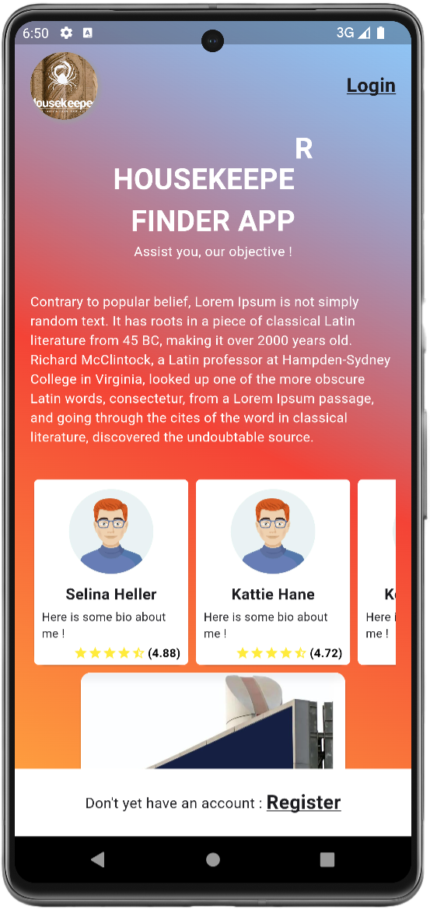

# HOUSEKEEPER - MOBILE APP

- [Introduction](#-introduction)
- [Installation](#-installation)

## Introduction
Here is the client side (Mobile App) codebase for the HOUSEKEEPER FINDER APP. Here is the description of how to make it run.
It is coded using the Flutter framework. Many libraries other that the minimal required ones where used and you can acces
the in the **pubspec.yaml** file.

## Installation
To run set up and make functional the codebase on a local machine or android phone, there are some requirements and steps to follow.

#### Requirements
- **Android Studio or VSCode** : Make sure your have one of these installed. For our case, we used **Android Studio** for the development
because it much more dedicated for Android development and does not required alot of configurations.
- **Dart** : Dart is the programming language on which flutter is based and since it is the framework we are going to use, it is essential 
you have it available. Make sur you get the most recent version.
- **Flutter**: We are using the flutter framework for development. This is because it permits us to develop once and deploy on the most used
terminal devices like **_android devices, pc devices, apple devices, ..._** with little turn arounds and small effort comparatively to building
it afresh for the different terminal devices.

#### Steps
- **Clone the project repository to you local machine** : Make the codebase available locally.
~~~bash
git clone https://github.com/samajestdigho/housekeeper.git
~~~

- Using the IDE of your choice, open the project.

- In the terminal of the IDE, hit the following command to download the dependencies
~~~bash
flutter pub get  # Get all the dependencies available in the pubspec.yaml file
~~~

- Use the Device Manager tool proposed by Android Studio to download and open a phone device on you machine or 
you can use you physical phone device (with developper mode turned on) to run the app.

- When the device (Android device) is connected, you can then run the app with the following command (_this command will install
the app on your device and run it_).
~~~bash
flutter run
~~~ 
**NB :** For the urls to function, you need to specify the URL of the api server so that it can collect data from there. To do this, go to :
~~~bash
lib > brain > constants > strings.dart 
~~~
From here, modify the variable named **baseServerURL** with the URL to your server. Maintain the **/api/v1/** to let it access the API.
You should be seeing the welcome page as follows.

**NB: _In case you will like to host it on a server, follow this very explicite and interesting video resources to make that comee through :_**
- Setup laravel project on Nginx server : [youtube](doc:https://youtu.be/c6ZsjOvGMGM?si=C2WLQA2a8D04lb3y)
- Setup MySQL on Nginx server and configure your laravel **.env** file : [youtube](doc:https://youtu.be/7yCoAN8p3b0?si=Z2CTE1o2QrVaf2Cb)

## Related Projects
- Housekeeper finder app (Server part)
